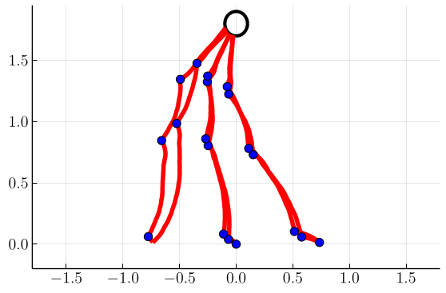

# Stochastic Optimal Control of a Sailboat

This repository implements the algorithms presented in *Stochastic Optimal Control of a Sailboat* by Cole Miles and Alex Vladimirsky for optimal
route planning of sailboats in stochastically-evolving weather. Our approach includes a collection of improvements for the
semi-Lagrangian algorithm proposed in *Optimal Route Planning for Sailing Boats: A Hybrid Formulation, Ferretti, Festa, (2019)*. In particular, we reduce the state space by one dimension by working
in a reduced coordinate formulation, and additionally develop a nearly-causal pseudotime discretization which allows the value iterations to converge in nearly-constant time. Also, we provide a more accurate modeling of the switching operator which evaluates the value function following a tack switch. Requires Julia ≥ 1.1.1.

<p align="center">
    
</p>

## Usage

This repo is structured as a library to be used in a Julia REPL or in short scripts. All of the logic is contained
 in five files

 - `types.jl`: Defines some data structures used throughout the code. Look here to see what fields each struct contains.
 - `valuesolvers.jl`: Implementations of our value iteration algorithms
 for various time discretizations and optimization strategies.
 - `simulation.jl`: Given the results of a value iteration,
 performs stochastically-sampled simulations of boats performing
 live control to reach a target.
 - `plotting.jl`: A collection of functions which visualizes the results of the code.
 - `SemiLagrangian.jl`: The main module file which assembles the former four and exposes functions to the users of the code.

The basic process of using this code is as follows:

1. Create a `ProblemParams` struct defining the problem you want to solve. Default problems are 
    defined as `deterministic_params` (fixed wind), `stochastic_params` (diffusive wind evolution),
    and `drift_stochastic_params` (drift-diffusive wind evolution).

2. Initialize a `ValueGrid` struct using `initialize_valuegrid()`, providing as arguments the bounds of the
grid, the discretization step sizes, and the `ProblemParams` from step (1). Default grids can be obtained
by calling one of `default_grid()`, `finer_grid()`, `extrafine_grid()`, `thefinestgrid()`, in order
of increasing granularity.

3. Load a polar plot from a tabular file. To do this,
    call `load_polars(fname)` to create a `PolarPlotSet` struct from a file. The source we use in our manuscript is `sunodyssey40.pol` from
    [this website](https://www.seapilot.com/features/download-polar-files/), provided in this repo at `scripts/polars/`. This struct contains
    contains a *set* of polar plots at various speeds. The library assumes a fixed wind speed, so pick one of the speeds out by indexing.
    (`polar_plot_set[2]` gives you the `PolarPlot` at the second available wind speed, etc.).

4. To perform value iterations to convergence, call `solve_value_sweep()`, providing as the first argument the `PolarPlot`, and additionally the `ValueGrid` and `ProblemParams`.  `λ` sets the time discounting factor (always zero in the manuscript), and `ϵ` sets the convergence criterion used to terminate the value iterations. This step returns a tuple (`ValueGrid`, `DirGrid`, `SwitchGrid`) containing the final results.

- Note: Setting `rowwise=true` in `solve_value_sweep` uses our nearly-causal discretization, while `rowwise=false` performs our "standard" Gauss-Seidel iterations. The former is much faster for most problems, but has slightly higher discretization errors.

5. To perform live trajectory simulations, call `liverun()`, providing as arguments the `PolarPlot`, the `SwitchGrid` and `DirGrid` from step (4), the `ProblemParams`, and a `starting_pt` tuple of `(r, θ, q)` of initial
conditions (polar r, θ, and initial tack). This step returns a `PolarTrajectory` containing the points of the trajectory
in polar coordinates. This can be converted to Cartesian coordinates by calling `convert(CartTrajectory, polar_traj)` where
`polar_traj` is the variable containing the `PolarTrajectory`. (All of the plotting functions do this for you automatically).

6. Plot results! Various useful plotting functions are

    - ```julia 
      plot_switchgrid(switchgrid :: SwitchGrid)
      ```
    - ```julia
      plot_polar(polar :: PolarPlot)
      ```
    - ```julia 
      plot_trajectory(traj :: PolarTrajectory, params :: ProblemParams)
      ```
    - ```julia
      anim_trajs(trajs :: Vector{PolarTrajectory}, params :: ProblemParams, fname :: String; freq :: Int)
      ```

**Important**: When using `anim_trajs`, be sure to set the `freq` keyword argument to set how often frames are drawn. By default,
  it will make one frame for every point in the trajectory, which is usually way too many. A good number depends on your choice of `Δt`, 
  and for `Δt=0.01` is around 20.

An example of this complete process is in `scripts/exampleStochasticProblem.jl`. The remaining scripts in that directory
reproduce the results of the manuscript after being run in a particular order.

1. Run `solve_problems.jl` to produce solution valuegrids, directiongrids,
   and switchgrids for all problem scenarios at all grid granularities.
   Note that this is a very long-running script! To accelerate this, one
   can either:
   1. Run julia with the flag `julia -p <N>`, where `N` is an integer.
      Then, the simulations will be distributed across `N` cores on your
      machine.
   2. Edit the `solve_problems.jl` file to reduce the number of mesh 
      granularities solved for, by removing the larger numbers at the
      end of the `granularities` list.
   Following this, the directory `scripts/Grids` will be populated by
   a large number of serialized solution grids used as input to the next
   step.
2. Run `plot_solutions.jl` to produce plots of the valuegrids and 
   switchgrids, and sampled sailboat trajectories under the solution
   control policies. Various plots will be deposited into
   `scripts/Plots`, `scripts/Images`, `scripts/Movies`. This requires
   that you ran step (1) at least up to granularity-16 (though you
   can manually edit this script to load lower-granularity grids).
3. Run `plot_refine.jl` to produce plots of the error scaling analysis,
   deposited into `scripts/Plots`. If you performed step (1.ii), be sure
   to edit the `granularities` list here as well!

## Installation

The easiest way to use this code is probably to clone this repository, navigate to the base directory, open up a Julia REPL,
 access the package manager by hitting `]`, then using the command `activate .` to enter the working environment defined by
 the project. Then the command `instantiate` will install all of the dependencies of the project. An `update` may also be
 required.

Once the environment is activated, you can go back to the regular REPL, and write `using SemiLagrangian` to import all
 of the functions/variables the library defines. You can then run the example script from within the REPL by writing
 `include("scripts/exampleStochasticProblem.jl")`.

Using the code this way means that every time you'd like to use the library in a new REPL, you must `activate` the environment through
 the package manager. As an alternative, open a new REPL (so that we're working in the global environment), enter the package manager, 
 and use the command `dev "."` to install the library in the global environment. Then, `using SemiLagrangian` will work from any REPL
 without having to activate the environment (and you can run `julia scripts/exampleStochasticProblem.jl` directly from the terminal instead
 of having to `include()` from a REPL).
